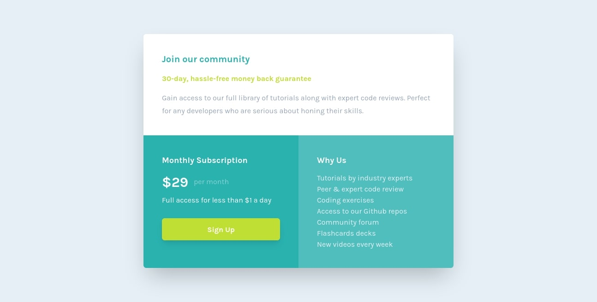

# Frontend Mentor - Single price grid component solution

This is a solution to the [Single price grid component challenge on Frontend Mentor](https://www.frontendmentor.io/challenges/single-price-grid-component-5ce41129d0ff452fec5abbbc). Frontend Mentor challenges help you improve your coding skills by building realistic projects.

## Table of contents

- [Overview](#overview)
  - [The challenge](#the-challenge)
  - [Screenshots](#screenshots)
  - [Links](#links)
- [Built with](#built-with)
- [Author](#author)

## Overview

### The challenge

Users should be able to:

- View the optimal layout for the component depending on their device's screen size
- See a hover state on desktop for the Sign Up call-to-action

### Screenshots

  

### Links

- Solution URL: [https://www.frontendmentor.io/solutions/single-price-grid-component-using-tailwind-css-and-css-grid-qxXs-eA45](https://www.frontendmentor.io/solutions/single-price-grid-component-using-tailwind-css-and-css-grid-qxXs-eA45)
- Live Site URL: [https://sissokho.github.io/frontendmentor-single-price-grid-component/](https://sissokho.github.io/frontendmentor-single-price-grid-component/)

### Built with

- Semantic HTML5 markup
- Tailwind CSS
- CSS Grid
- Mobile-first workflow
## Author

- Frontend Mentor - [@sissokho](https://www.frontendmentor.io/profile/sissokho)
- Twitter - [@mm_sissokho](https://twitter.com/mm_sissokho)
- Linkedin - [Mouhamadou Moustapha SISSOKHO](https://www.linkedin.com/in/mouhamadou-moustapha-sissokho-548a55125/)
